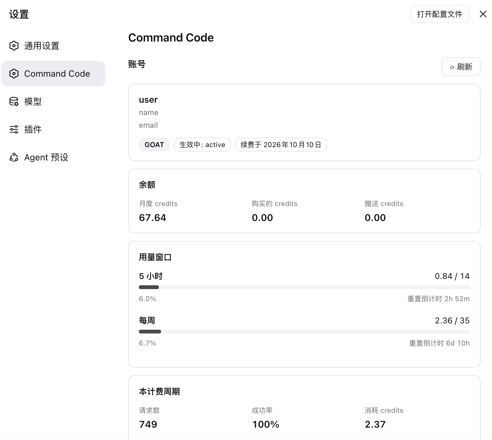
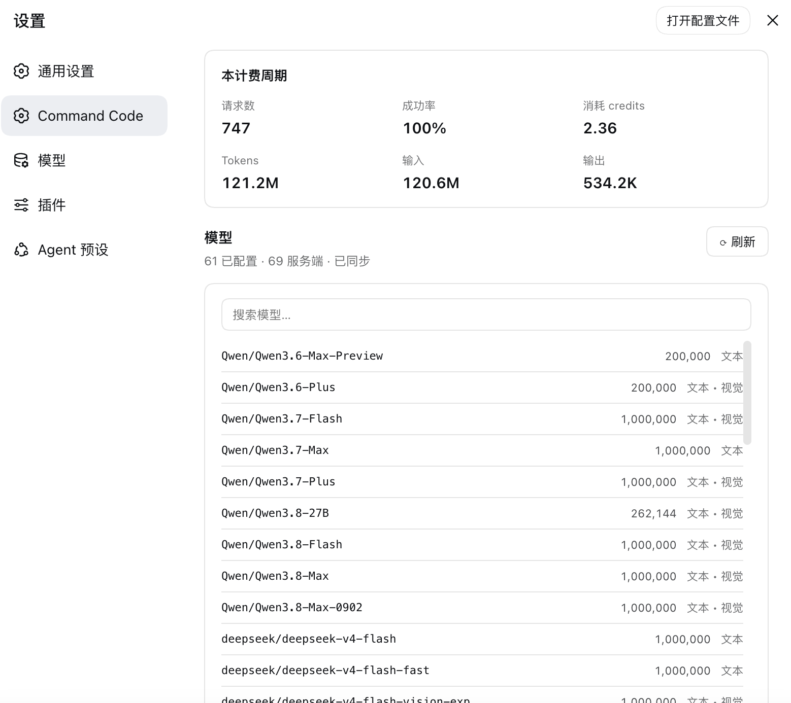

# commandcode-dash

[English](README.md) | 中文

> 在 DeepSeek Harness 的设置面板里，直接查看 Command Code 的 credits、用量窗口与模型目录。
>
> **非官方社区插件。** 与 DeepSeek 及 Command Code 均无隶属、背书或赞助关系。

[](https://github.com/Momonaka/commandcode-dash/actions/workflows/ci.yml)
[](#)
[](#)
[](#)
[](LICENSE)

一个 [DeepSeek Harness](https://github.com/deepseek-ai/deepseek-harness)（DSH）
Web 插件，在设置面板中新增 **Command Code** 分区，让你不用离开界面就能回答两个问题：

- **还剩多少？** 套餐、credits 余额、5 小时与每周用量窗口（含实时重置倒计时），
  以及本计费周期的统计。
- **我能跑什么？** 已配置的模型目录与 `provider/v1/models` 实时目录的差异对比，
  并可一键同步。

## 功能特性

| | |
|---|---|
| **Credits** | 来自实时计费接口的月度、购买与赠送 credits 余额。 |
| **用量窗口** | 5 小时与每周窗口，显示 `used / cap`（已用 / 上限）、进度条，以及会自行走动的 `resets in …` 倒计时（不重新请求）。 |
| **计费周期** | 请求数、成功率、消耗 credits 与 Token 总量。 |
| **模型目录** | 列出每个已配置模型及其上下文窗口与模态，支持搜索。 |
| **目录同步** | 对比实时目录与你的配置，然后在你确认后执行新增、补齐上下文窗口与移除。 |
| **引导卡片** | 未配置 key 时，该分区会变成一个表单，以只写方式保存 key。 |

## 界面预览





## 环境要求

- 一份可用 `web` profile 的 DSH 安装。
- 一个有 Provider API 权限的 Command Code 套餐 —— **除 Go 之外的套餐都可以**。
  上游返回 `upgrade_required` 时，插件会给出明确提示而非笼统报错。
- 主机侧 Node 20+（插件用到了 `AbortSignal.any`）。

## 安装

### 从 GitHub 安装

`dsh plugin` 内部调用的是 **pnpm**，而原版 Node 安装并不自带它。先启用 Node 自带的
corepack shim，再安装：

```sh
corepack enable pnpm
dsh plugin --profile web add github:Momonaka/commandcode-dash
```

没有 pnpm 时，该命令会以 `dsh: pnpm not found on PATH` 停下。若不想启用 pnpm，
可用下方的本地检出方式 —— 本插件没有依赖，一个软链就够了。

安装过程会打印一条 `declares no dsh.bundle` 警告。这是预期行为：本插件是通过
下方的 patch 条目挂载的，而不是作为 profile 层。

### 从本地检出安装

```sh
git clone https://github.com/Momonaka/commandcode-dash ~/dsh-plugins/commandcode-dash
mkdir -p "${DSH_HOME:-$HOME/.dsh}/profiles/web/node_modules"
ln -sfn ~/dsh-plugins/commandcode-dash \
        "${DSH_HOME:-$HOME/.dsh}/profiles/web/node_modules/commandcode-dash"
```

一个软链就够了，因为主机半**零 import** —— 不需要从 profile 自己的
`node_modules` 解析任何 `@deepseek-ai/*` 说明符，所以该包无需真正的安装步骤
即可工作。

### 挂载插件

profile 的 patch 层初始内容是一个空数组 `[]`。请**把那个 `[]` 替换掉**，而不是在
它后面追加 —— 否则会产生非法 YAML，profile 将拒绝启动。文件位于
`${DSH_HOME:-$HOME/.dsh}/profiles/web/cordis.patch.yml`：

```yaml
- insert:
    - id: commandcode
      name: commandcode-dash
```

然后重启 web profile：

```sh
dsh --profile web
```

### 验证

`commandcode` 应出现在组装树的末尾：

```sh
dsh --profile web --dump-config | grep -A1 commandcode
```

## 配置

### API key

key 只从一处读取：harness 凭据库中引用名为 `COMMANDCODE_API_KEY` 的记录。
本分区自带的引导卡片会写入该处，也可以手工添加：

```yaml
# ${DSH_HOME:-$HOME/.dsh}/.credentials.yaml
refs:
  COMMANDCODE_API_KEY: user_…
```

它在主机侧按请求解析，因此保存后下次刷新即生效，无需重启。

## 免责声明

这是一个**非官方、社区构建**的插件。它与 DeepSeek 及 Command Code 均无隶属、
背书或赞助关系，也不属于这两者的任何产品。「DeepSeek」「DeepSeek Harness」
「Command Code」是各自所有者的商标，此处仅用于说明本插件与什么互操作。

它使用**你自己的** API key 访问 Command Code 的 Provider API，走的是 Command
Code CLI 自己那个用量界面所用的同一批接口。除此之外不向任何地方发送数据，除了
harness 已经持有的凭据之外也不存储任何东西。

那些接口属于该 CLI 的内部实现，而非公开的正式契约，因此可能随时变更 —— 围绕
API 访问的套餐规则同样如此。一旦发生变更，本面板会报错而不是静默失败，修复则
意味着更新本插件。请自行斟酌使用。

## 许可证

[MIT](LICENSE) © Momonaka

本项目与 DeepSeek 及 Command Code 无隶属或背书关系。
